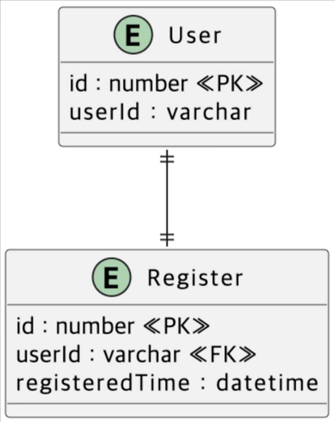

# 2주차 과제 - 특강 신청 서비스

#### 가족 행사로 주말 동안 시간을 내지 못해서 과제 완성도가 낮습니다... 양해 부탁드립니다...!!

## 요구사항
- API
  - 특강 신청
  - 특강 신청 여부 조회
- 각 기능 / 제약 사항마다 1개 이상 유닛 테스트
- 다수 인스턴스가 작동하더라도 기능에 문제 없게끔
- 동시성 고려
- 정확히 30명의 사용자에게만 특강을 제공할 방법을 고려
- 같은 사용자에게 여러 번의 특강 슬롯이 제공되지 않도록 제한

## ERD

## API 명세

### 특강 신청 API (핵심)
#### 상세 스펙
- 선착순으로 제공
- userId로 신청
- 4/20(토) 1시에 open
- 선착순 30명만 신청 가능
- 30명 초과하면, 이후 신청자는 요청 실패

### 특강 신청 완료 여부 조회 API (기본)
- userId로 조회
- 특강 신청 성공한 사람은 성공, 명단에 없는 사람은 실패를 반환

### 특강 선택 API (선택)
- 일회성이 아닌, 날짜별로 특강이 있는 범용적인 서비스로 확장
- 특강 엔티티를 기존 설계에서 변경해야 함
- 특강 정원은 30명으로 고정
- 사용자는 특강 신청 전, 목록 조회 가능해야 함

